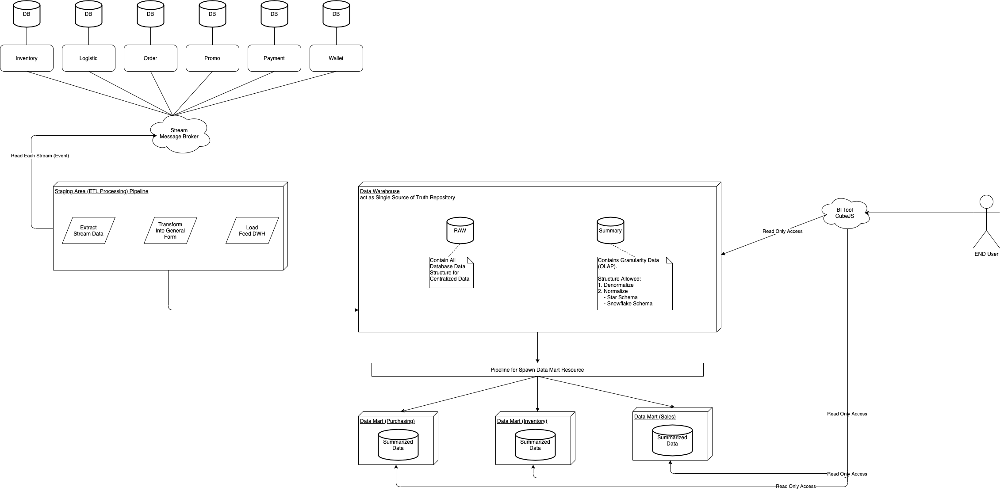

# Data Warehouse
Merupakan sentralisasi dari berbagai Data Source (Transactional Database). Data Warehouse didesign untuk memenuhi informasi bisnis.

### Contoh

Perusahaan XYZ berbasis E-Commerce memiliki beberapa Microservice sebagai berikut:

1. Inventory
2. Order
3. Promo
4. Payment
5. Wallet
6. Logistic

dimana komunikasi antar service melalui Stream (Message Broker).

Sebelum Data dari tiap Service di-load kedalam DWH, Data tersebut perlu diolah dalam Staging Area, dimana data-data tersebut akan melalui proses ETL.

#### E (Extract)
> Proses memilih dan mengambil data dari berbagai sumber.

#### T (Transform)
> Proses pembersihan data dari proses *Extract* menjadi bentuk yang lebih informatif atau general.

#### L (Loading)
> Proses memasukkan data yang telah di-*Transform* ke dalam Data Warehouse.

#### Data Warehouse
Memiliki 1 atau lebih Database, pada umumnya terdapat Database:

1. **RAW**
> DB RAW dimana semua data OLTP digabungkan menjadi satu. Guna untuk Centralize Data agar memiliki Insight yang lebih bagus.

2. **Summary (OLAP)**
> DB Summary (OLAP) digunakan untuk menyimpan data-data yang telah melalui proses Staging Area.

#### OLAP
Data yang disimpan kedalam OLAP boleh dalam bentuk Denormalize (UNF) atau Semi-Normalize(2NF), dimana Struktur Semi-Normalize dapat menggunakan skema sebagai berikut

1. Star Schema

Star Schema akan memisahkan table `Fact` dengan table `Dimension`. Table `Fact` akan memiliki Relation terhadap setiap `Dimension`, sedangkan table `Dimension` merupakan table final.

2. Snowflake Schema

Samahalnya dengan Star Schema, yang membedakan Table `Dimension` dapat memiliki relasi terhadap Table `Dimension` lainnya.

#### Fact
Table yang mengandung beberapa `Primary Key` table `Dimension` atau tolak ukur suatu data (kolom data yang dapat dilakukan proses kalkulasi).

Key of Fact :

1. Numerical Measure
2. Can Analyze relationship between dimension.

**Sales Fact**
| | |
| -- |:-------------- |
|    | product_id     |
| FK | transaction_id |
|    | qty            |

**Coupon Fact**
| | |
| -- |:-------------- |
| FK | transaction_id |
| FK | coupon_id      |
| FK | time_id        |
|    | qty            |
|    | avg_used       |

Which `time_id` is represent `Time Dimension` with value like : `Day`, `Month`, `Quarter`, or `Year`.

#### Dimension
Table yang mengandung data informatif atau (support data) untuk semua data kalkulasi yang telah direcord di-`Fact` table.

Key of Dimension:

1. Data yang mendefinisikan bagaimana angka `measurement` dan `summary` dapat terjadi.

**Time Dimension**
| | |
| -- |:------- |
| PK | time_id |
|    | day     |
|    | month   |
|    | quarter |
|    | year    |

**Product Dimension**
| | |
| -- |:---------- |
| PK | product_id |
|    | name       |
|    | brand      |
|    | sold_by    |

#### Data Mart
Merupakan subset dari Data Warehouse, hampir sama cuma scopenya lebih kecil.

Pada layer Data Mart, tim DWH dapat membuatkan View atau Table baru untuk memenuhi request dari Department dari suatu Perusahaan.

Dimana akan terdapat Pipeline untuk meng-insert data yang baru masuk ke dalam table yang baru tersebut.